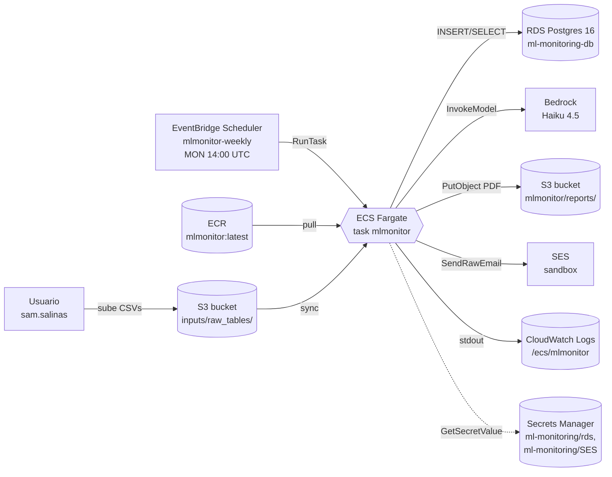

# Módulo 01 — Arquitectura general

## Objetivo

Dibujar de memoria el flujo completo de MLMonitor en AWS y justificar por qué se eligió ECS Fargate + EventBridge Scheduler sobre Lambda + Step Functions.

## Conceptos

**Flujo de datos end-to-end:**

1. **Input:** CSVs semanales se suben manualmente a `s3://ml-monitoring-reports-credito/inputs/raw_tables/`.
2. **Disparo:** EventBridge Scheduler dispara una ECS task cada lunes 14:00 UTC (08:00 CDMX).
3. **Compute:** Fargate levanta un contenedor basado en la imagen `mlmonitor:latest` de ECR. Tiene IP pública (IGW) para hablar con servicios AWS.
4. **Entrada de datos:** el contenedor hace `aws s3 sync` de los CSVs a filesystem local.
5. **ETL:** corre `run_incremental_etl.py` → escribe en RDS Postgres 16 tablas `FACT_*`.
6. **Pipeline:** corre `run_pipeline.py` → calcula métricas → llama a Bedrock Haiku 4.5 para narrativa → genera PDF con WeasyPrint → sube a S3 y envía por SES.
7. **Logs:** todo fluye a CloudWatch `/ecs/mlmonitor` con retención 30 días.

### Diagrama



## ¿Por qué ECS Fargate y no Lambda?

1. **Timeout.** Lambda ≤ 15 min. El pipeline con WeasyPrint + Bedrock + métricas puede rozar ese límite.
2. **Libs nativas.** WeasyPrint necesita Cairo/Pango (binarios del SO). Con Lambda te obligas igualmente a imagen de contenedor, perdiendo su ventaja (Lambda ZIP).
3. **Simplicidad.** El flujo es lineal, no hay paralelismo ni fan-out. Step Functions es overkill.
4. **Mismo runtime que local.** La imagen que corre en Fargate es la misma que tu Docker en laptop — debuggeable.

**Trade-off aceptado:** Fargate tiene cold start ~30-60s (pull de ECR + init). Para un cron semanal, irrelevante.

Ver ADR completa en [`docs/decisions.md §8.2.20`](../decisions.md).

## Lo que construí yo

- Un solo ECR repo: `mlmonitor` con tags `v0.1.0` + `latest`.
- Un solo cluster ECS: `mlmonitor-cluster` (Fargate-only, sin capacity providers).
- Una sola task definition: `mlmonitor:1` (CPU 1024, memoria 4096).
- Un solo schedule: `mlmonitor-weekly`.
- Tres roles IAM (ver módulo 02).
- Un bucket S3 con dos prefijos (inputs + reports).

**Decisión de economía:** todo en la VPC default, subnets públicas, `assignPublicIp=ENABLED`. **No** hay NAT Gateway (costaría ~$35/mes y no aporta en MVP). Deuda técnica documentada.

## Track A — Inspección read-only

```bash
# Cluster y tasks corriendo
aws ecs describe-clusters --clusters mlmonitor-cluster \
  --query 'clusters[0].{status:status,runningTasks:runningTasksCount,activeServices:activeServicesCount}'

# La family de task definition
aws ecs list-task-definitions --family-prefix mlmonitor

# El schedule
aws scheduler get-schedule --name mlmonitor-weekly \
  --query '{state:State,cron:ScheduleExpression,tz:ScheduleExpressionTimezone}'

# Última ejecución (si ya corrió)
aws ecs list-tasks --cluster mlmonitor-cluster --desired-status STOPPED --max-items 3
```

## Ejercicios

1. Sin mirar arriba, dibuja en papel el flujo con 7 flechas. Compáralo con el diagrama.
2. Responde: ¿qué pasaría si desactivo el IGW de la VPC default? (Pista: ECS no podría pullear de ECR.)
3. Responde: ¿por qué no usamos EC2 en vez de Fargate? (Pista: costo fijo vs por-ejecución.)

## Checklist de dominio

- [ ] Puedo nombrar los 7 servicios AWS involucrados.
- [ ] Sé por qué rechazamos Lambda.
- [ ] Sé en qué momento interviene Bedrock.
- [ ] Entiendo qué hace el IGW en este flujo.

## Referencias

- [ADR §8.2.20](../decisions.md)
- [`aws_deployment.md`](../infrastructure/aws_deployment.md)
