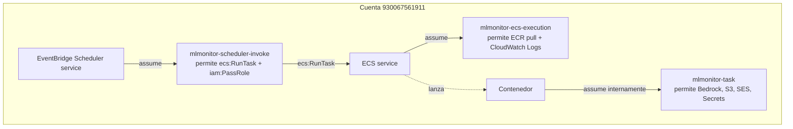

# Módulo 02 — Fundamentos AWS (IAM, VPC, SG)

## Objetivo

Entender las primitivas AWS que reaparecerán en cada módulo: IAM (users, roles, trust policies, permission policies), y networking (VPC, subnets, Security Groups, IGW). Sin esto, la mitad de los errores futuros son incomprensibles.

## Conceptos — IAM

**User vs Role.** Un *user* tiene credenciales persistentes (tú). Un *role* lo **asume** alguien temporalmente — un servicio AWS, otra cuenta, o un user.

**Trust policy** (¿quién puede asumir este rol?): un documento JSON con `Principal` → e.g. `"ecs-tasks.amazonaws.com"`.

**Permission policy** (¿qué puede hacer el rol?): JSON con `Action` + `Resource` + `Effect`.

**Managed vs inline.** Managed = reusable entre roles (AWS-managed o customer-managed). Inline = pegada al rol, no reusable. Usamos inline cuando la policy es específica del rol.

### Por qué hay 3 roles en MLMonitor



1. **`mlmonitor-ecs-execution`** — lo asume **ECS mismo** (no tu código). Sirve para que ECS pueda pullear la imagen de ECR y escribir logs en CloudWatch.
2. **`mlmonitor-task`** — lo asume el **proceso dentro del contenedor**. Sirve para que tu código llame Bedrock, lea S3, mande correo.
3. **`mlmonitor-scheduler-invoke`** — lo asume **EventBridge Scheduler**. Sirve para que pueda llamar `ecs:RunTask` y hacer `iam:PassRole` de los dos anteriores.

**¿Por qué `iam:PassRole`?** Porque al llamar RunTask, le estás **entregando** los roles execution y task a ECS. AWS exige permiso explícito para "pasar" roles — de lo contrario cualquiera que pueda crear tasks podría escalar a los permisos del task role.

## Conceptos — Networking

**VPC** = red virtual privada. Cada cuenta tiene una VPC "default" por región.

**Subnet** = segmento de IP dentro de la VPC, ligado a una AZ (zona de disponibilidad). "Pública" = tiene ruta al IGW; "privada" = no.

**IGW (Internet Gateway)** = puerta para salir/entrar a internet en subnets públicas.

**NAT Gateway** = permite a subnets privadas salir a internet sin ser alcanzables. No lo usamos (costo).

**Security Group (SG)** = firewall stateful a nivel de ENI (interfaz de red). Tiene reglas `inbound` y `outbound`. Por default: outbound `all`, inbound `nada`.

### Por qué MLMonitor usa VPC default con IP pública

- ECS Fargate necesita salir a ECR, Bedrock, SES, S3, Secrets Manager. Desde una subnet pública con IP pública, sale por IGW → fácil.
- Desde una subnet privada necesitarías **NAT Gateway** (~$35/mes + data) o **VPC endpoints** (uno por servicio, gestionables pero más trabajo).
- Para un MVP, subnet pública + SG egress-all es suficiente. Deuda técnica documentada.

## Track A — Inspección real

```bash
# Los 3 roles
for R in mlmonitor-ecs-execution mlmonitor-task mlmonitor-scheduler-invoke; do
  echo "=== $R ==="
  aws iam get-role --role-name $R --query 'Role.AssumeRolePolicyDocument.Statement[0].Principal'
done

# Policies asociadas al task role
aws iam list-attached-role-policies --role-name mlmonitor-task
aws iam list-role-policies --role-name mlmonitor-task

# SG de Fargate
aws ec2 describe-security-groups --group-ids sg-0c54b54ed399b471c \
  --query 'SecurityGroups[0].{name:GroupName,ingress:IpPermissions,egress:IpPermissionsEgress}'

# VPC default
aws ec2 describe-vpcs --filters Name=isDefault,Values=true \
  --query 'Vpcs[0].{id:VpcId,cidr:CidrBlock}'
```

## Problemas que encontré

- **SES AccessDenied (primer smoke test).** La policy del task role autorizaba la identity del sender (`1206029@...`) pero no la del recipient (`samsalriu@...`). SES exige permiso sobre **ambas** identities cuando `Resource != "*"`. Fix: agregar ambos ARNs + `Condition ses:FromAddress=1206029@...`. Lección: IAM evalúa contra **todos** los recursos que toca la acción, no solo el obvio.

## Ejercicios

1. Abre `deploy/iam/trust-ecs-tasks.json` y `deploy/iam/trust-scheduler.json`. Identifica el `Principal` de cada uno.
2. Lee `deploy/iam/mlmonitor-task-policy.json` y responde: ¿por qué `S3Read` lista dos recursos (el bucket y el prefijo)?
   - **Pista:** `s3:ListBucket` se hace sobre el bucket; `s3:GetObject` sobre el objeto. No es el mismo ARN.
3. Corre `aws ec2 describe-security-groups --group-ids sg-02e9d008b587402f7` y encuentra la regla que es deuda técnica (5432 abierto a `0.0.0.0/0`).

## Checklist de dominio

- [ ] Sé qué es un trust policy y puedo leer uno.
- [ ] Puedo explicar por qué existen 3 roles y no uno solo.
- [ ] Entiendo por qué `iam:PassRole` es necesario en el rol del Scheduler.
- [ ] Sé la diferencia entre subnet pública y privada.
- [ ] Sé por qué MLMonitor **no** usa NAT Gateway.

## Referencias

- [IAM roles para servicios AWS](https://docs.aws.amazon.com/IAM/latest/UserGuide/id_roles_terms-and-concepts.html)
- [PassRole explained](https://docs.aws.amazon.com/IAM/latest/UserGuide/id_roles_use_passrole.html)
- Interno: [`docs/infrastructure/aws_iam.md`](../infrastructure/aws_iam.md)
