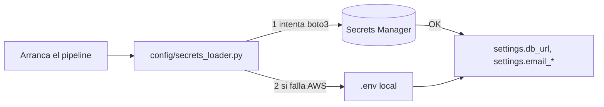

# Módulo 03 — Datos: RDS Postgres y Secrets Manager

## Objetivo

Conectarte a la RDS real desde tu laptop, entender por qué está `publicly_accessible`, y aprender cómo el código carga credenciales desde Secrets Manager con fallback a `.env`.

## Conceptos

**RDS Postgres 16.** Instancia administrada por AWS. Endpoint: `ml-monitoring-db.cepye8aei35e.us-east-1.rds.amazonaws.com:5432`. DB `mlmonitor`, usuario `mlmonitor_admin`.

**`publicly_accessible`** significa que RDS tiene una IP pública en el IGW. Sin esto, solo recursos en la misma VPC pueden hablarle. Para MVP lo aceptamos porque el SG de RDS (aunque hoy está abierto `0.0.0.0/0`, deuda) es quien autoriza a nivel de red.

**Secrets Manager** es un servicio gestionado para guardar strings JSON cifrados. Ventajas: rotación automática (no la usamos aún), permisos granulares por ARN, auditoría por CloudTrail.

### Flujo de carga de credenciales



El `secrets_loader` intenta Secrets Manager primero; si `boto3` no está disponible o no hay credenciales, cae a `.env`. Esto permite correr el pipeline **sin AWS** en desarrollo. Lazy import: `boto3` solo se importa dentro de la función.

## Secretos reales

| Secret ID | Contenido | Consumido por |
|---|---|---|
| `ml-monitoring/rds` | `{"username": "...", "password": "...", "host": "...", "port": 5432, "dbname": "mlmonitor"}` | `secrets_loader.py` → arma `DB_URL` |
| `ml-monitoring/SES` | `{"sender_email": "1206029@onuriscp.com", "recipient_email": "samsalriu@gmail.com"}` | `SESEmailSender` |

**Nota:** `SES` va con mayúsculas (D1 en `dudas_documentacion.md`). Secrets Manager **distingue** mayúsculas en el ID.

## Track A — Inspección real

```bash
# Instancia RDS
aws rds describe-db-instances --db-instance-identifier ml-monitoring-db \
  --query 'DBInstances[0].{engine:Engine,version:EngineVersion,endpoint:Endpoint.Address,public:PubliclyAccessible,sg:VpcSecurityGroups}'

# Secretos existen
aws secretsmanager list-secrets --filters Key=name,Values=ml-monitoring \
  --query 'SecretList[].Name'

# Leer el secreto de RDS (cuidado: imprime password en terminal)
aws secretsmanager get-secret-value --secret-id ml-monitoring/rds \
  --query SecretString --output text | jq 'keys'
# Solo las claves (sin valores), para no exponer

# Conectar a RDS usando las credenciales
export PGPASSWORD=$(aws secretsmanager get-secret-value --secret-id ml-monitoring/rds \
  --query SecretString --output text | jq -r '.password')
export PGUSER=$(aws secretsmanager get-secret-value --secret-id ml-monitoring/rds \
  --query SecretString --output text | jq -r '.username')

psql -h ml-monitoring-db.cepye8aei35e.us-east-1.rds.amazonaws.com \
     -U $PGUSER -d mlmonitor -c "\dt META_*"
```

Debes ver las tablas `META_*` (modelo de datos congelado, ver `CLAUDE.md`).

## Track B — Tu propia instancia (opcional)

Solo hazlo si quieres entender el proceso. Crear una instancia RDS cuesta ~$15/mes, acuérdate de borrarla:

```bash
# t3.micro gratis en free tier (primeros 12 meses)
aws rds create-db-instance \
  --db-instance-identifier mlmonitor-db-curso-${CURSO_ALIAS} \
  --db-instance-class db.t3.micro \
  --engine postgres --engine-version 16 \
  --master-username admin --master-user-password $(openssl rand -base64 20) \
  --allocated-storage 20 \
  --publicly-accessible \
  --no-multi-az --backup-retention-period 0
```

**Teardown al terminar el curso:** `sandbox/teardown.sh` lo incluye.

## Problemas que encontré

- **`pg_dump` version mismatch.** Mi laptop tenía `pg_dump` v14, RDS es v16. Error `server version: 16.x; pg_dump version: 14.x; aborting`. Fix: `brew install postgresql@16 && export PATH="/opt/homebrew/opt/postgresql@16/bin:$PATH"`. Concepto: pg_dump solo dumpea versiones ≤ la propia.

## Ejercicios

1. Lista todas las tablas `META_*` y `FACT_*`. Identifica cuáles son SCD2 (clue: tienen `valid_from` / `valid_to`).
2. Sin escribir el password, muestra solo la `username` del secreto RDS.
3. Corre `bash docs/curso/scripts/check_m03_rds.sh` y confirma conectividad.

## Checklist de dominio

- [ ] Sé por qué `publicly_accessible=true` es deuda técnica.
- [ ] Sé cómo el código decide si usar Secrets Manager o `.env`.
- [ ] Puedo conectar a RDS con `psql` usando credenciales del secreto.
- [ ] Sé por qué el secret de SES está con mayúsculas.

## Referencias

- Interno: [`config/secrets_loader.py`](../../src/mlmonitor/config/secrets_loader.py)
- Interno: [`docs/infrastructure/aws_secrets_manager.md`](../infrastructure/aws_secrets_manager.md)
