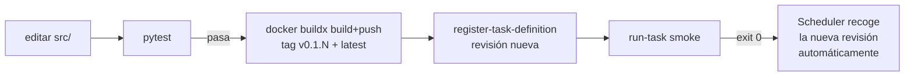

# Módulo 12 — Operación diaria

## Objetivo

Responder las 4 preguntas operativas reales: re-ejecutar semana X, backfill histórico, empujar cambios de código, y cambiar una tabla META (SCD2).

## 1. Re-ejecutar una semana específica

**Caso de uso:** quieres regenerar el PDF de semana 18 (2025-12-22) porque corrigieron los CSVs.

Hoy `entrypoint.sh` auto-detecta la fecha desde `MAX(semana_observacion)` del CSV. Para forzar una fecha distinta hay **dos opciones**:

### Opción A — Correr desde laptop contra RDS (más simple)

```bash
cd mlmonitor

# Exporta credenciales desde Secrets Manager
eval "export DB_URL=postgresql://$(aws secretsmanager get-secret-value --secret-id ml-monitoring/rds \
  --query SecretString --output text \
  | jq -r '"\(.username):\(.password)@\(.host):\(.port)/\(.dbname)"')"

# Corre solo el pipeline (no el ETL — los FACTs ya están en RDS)
poetry run python scripts/run_pipeline.py --date 2025-12-22 --no-email
```

`--no-email` evita re-enviar correo. El PDF se genera en `artifacts/reports/` y se sube a S3.

### Opción B — `run-task` con override (implementado)

Desde 2026-04-27 (ADR §8.2.21, task def `mlmonitor:2`), `entrypoint.sh` lee 4 env vars opcionales: `RUN_DATE`, `SKIP_ETL`, `NO_EMAIL`, `NO_LLM`. Sin ellas, el comportamiento es idéntico al schedule semanal.

Para re-ejecutar semana X en ECS:

```bash
aws ecs run-task \
  --cluster mlmonitor-cluster --launch-type FARGATE --task-definition mlmonitor \
  --network-configuration "awsvpcConfiguration={subnets=[subnet-0dcfd7651de484c9b,subnet-0e5ed52bc4d23416d],securityGroups=[sg-0c54b54ed399b471c],assignPublicIp=ENABLED}" \
  --overrides '{
    "containerOverrides": [{
      "name": "mlmonitor",
      "environment": [
        {"name": "RUN_DATE", "value": "2025-12-22"},
        {"name": "SKIP_ETL", "value": "1"},
        {"name": "NO_EMAIL", "value": "1"},
        {"name": "NO_LLM",   "value": "1"}
      ]
    }]
  }' --count 1
```

`SKIP_ETL=1` regenera solo el PDF si los datos ya están en RDS. `NO_EMAIL=1` y `NO_LLM=1` son útiles para validar imagen sin disparar SES/Bedrock.

**Recomendación:** Opción A para regenerar un PDF puntual desde laptop; Opción B cuando quieres validar la imagen Docker recién pusheada o re-correr en el mismo entorno que el schedule.

## 2. Backfill histórico de `FACT_METRICS_HISTORY`

**Caso de uso:** quieres poblar el histórico completo desde semana 1 hasta hoy para gráficas de tendencias.

**Decisión:** se hace **desde laptop**, no desde ECS. Es one-shot y ECS no aporta nada (no hay schedule recurrente).

### Script de backfill

Implementado en `scripts/backfill.py` (orquestador por subprocess; itera lunes ISO y llama `run_incremental_etl.py` + `run_pipeline.py --no-email --no-llm`). Inyecta `S3_BUCKET=""` en el environment para que los PDFs históricos no se suban a S3.

```bash
# Backfill completo (ETL + pipeline)
poetry run python scripts/backfill.py --start 2025-09-01 --end 2026-01-05

# Solo pipeline (datos ya en RDS, p.ej. cambió fórmula de PSI)
poetry run python scripts/backfill.py --start 2025-09-01 --end 2026-01-05 --skip-etl

# Una sola semana
poetry run python scripts/backfill.py --start 2025-10-13 --end 2025-10-13
```

Los PDFs se generan en `artifacts/reports/` local — bórralos al terminar (`rm -rf artifacts/reports/`).

**Idempotencia:** el pipeline usa `UniqueConstraint` sobre la clave de negocio → re-corridas no duplican filas.

## 3. Empujar cambios de código a ECS

Flujo estándar tras editar `src/`:



**Paso a paso:**

```bash
# 1) Tests pasan localmente
poetry run pytest

# 2) Build + push
cd mlmonitor
VERSION=v0.1.$(($(aws ecr describe-images --repository-name mlmonitor \
  --query 'imageDetails[].imageTags[]' --output text | grep -oE 'v0\.1\.[0-9]+' \
  | sort -V | tail -1 | sed 's/v0\.1\.//') + 1))
echo "Nueva versión: $VERSION"

aws ecr get-login-password --region us-east-1 \
  | docker login --username AWS --password-stdin 930067561911.dkr.ecr.us-east-1.amazonaws.com

docker buildx build --platform linux/amd64 \
  -t 930067561911.dkr.ecr.us-east-1.amazonaws.com/mlmonitor:${VERSION} \
  -t 930067561911.dkr.ecr.us-east-1.amazonaws.com/mlmonitor:latest \
  --push .

# 3) Registrar nueva revisión de task def
aws ecs register-task-definition --cli-input-json file://deploy/taskdef.json \
  --query 'taskDefinition.revision'

# 4) Smoke test (ver módulo 10)
aws ecs run-task --cluster mlmonitor-cluster --launch-type FARGATE \
  --task-definition mlmonitor \
  --network-configuration "awsvpcConfiguration={subnets=[subnet-0dcfd7651de484c9b,subnet-0e5ed52bc4d23416d],securityGroups=[sg-0c54b54ed399b471c],assignPublicIp=ENABLED}" \
  --count 1
# Seguir logs, confirmar exit 0

# 5) Rollback si algo salió mal
# Ver módulo 07 (retag latest → versión anterior)
```

**Por qué basta con registrar nueva revisión:** el Scheduler target es `mlmonitor` (family sin sufijo). AWS Scheduler resuelve a la revisión más reciente en cada invocación.

## 4. Cambios a tablas META (SCD2)

**Caso de uso:** necesitas cambiar `score_max` del modelo `BAZBOOST_V1` de 1000 a 850.

**Regla sagrada (CLAUDE.md):** nunca `UPDATE` ni `DELETE` una fila SCD2. Siempre:
1. `UPDATE` de la fila activa: setear `valid_to = NOW()`.
2. `INSERT` de la fila nueva: mismos IDs de negocio, valores nuevos, `valid_from = NOW()`, `valid_to = NULL`.

### Ejemplo SQL

```sql
BEGIN;

-- Cierra la fila actual
UPDATE "META_MODEL_REGISTRY"
SET valid_to = now()
WHERE model_id = 'BAZBOOST_V1'
  AND valid_to IS NULL;

-- Inserta la nueva
INSERT INTO "META_MODEL_REGISTRY"
  (model_id, score_max, <otras columnas>, valid_from, valid_to)
VALUES
  ('BAZBOOST_V1', 850, <mismos valores>, now(), NULL);

COMMIT;
```

**Por qué así:** queries históricas (`WHERE valid_from <= run_date AND (valid_to IS NULL OR valid_to > run_date)`) siguen devolviendo el valor correcto para cualquier fecha pasada.

**Cambios que no son SCD2:** no todas las META son SCD2. Revisa `src/mlmonitor/db/models.py` — solo las que tienen `valid_from` / `valid_to`. Las de configuración sin histórico (p. ej. `META_PIPELINE_CONFIG` si existiera) son UPDATE in-place.

### Cómo aplicar en RDS

```bash
# Abre psql con credenciales del secreto
export PGPASSWORD=$(aws secretsmanager get-secret-value --secret-id ml-monitoring/rds \
  --query SecretString --output text | jq -r '.password')
psql -h ml-monitoring-db.cepye8aei35e.us-east-1.rds.amazonaws.com \
     -U mlmonitor_admin -d mlmonitor \
     -f migrations/YYYY-MM-DD_score_max_update.sql
```

> ⚠️ Antes de migraciones destructivas: `pg_dump` a `data/backups/` (ver `aws_deployment.md §3.8`).

## Ejercicios

1. **Opción A re-ejecución:** corre el pipeline desde laptop contra RDS para `--date 2025-10-13` con `--no-email`. Verifica que el PDF aparece en `artifacts/reports/`.
2. **Push de cambio trivial:** cambia el título del PDF en `src/mlmonitor/report/...`, corre pytest, construye v0.1.N, pushea, registra revisión, smoke test. Rollback al terminar.
3. **Simulación SCD2:** en tu DB local (`mlmonitor_dev.db` por `run_bootstrap.py`), ejecuta el patrón cerrar+insertar sobre una META. Verifica que queden 2 filas (1 con `valid_to NOT NULL`, 1 con `valid_to NULL`).

## Checklist de dominio

- [ ] Sé cómo re-ejecutar una semana histórica por dos caminos.
- [ ] Puedo escribir un script de backfill idempotente.
- [ ] Sé el flujo completo de push de código a ECS.
- [ ] Puedo escribir un SCD2 update en SQL sin perder historia.

## Referencias

- Interno: [`CLAUDE.md`](../../CLAUDE.md) sección "Convenciones de código"
- Interno: [`docs/architecture/data_model.md`](../architecture/) (si existe)
