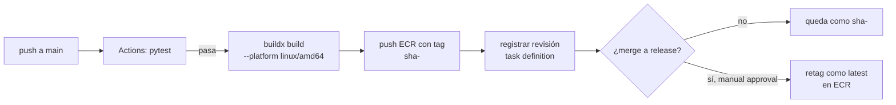

# Módulo 13 — Evolución a CI/CD y siguiente nivel

## Objetivo

Diseñar (no implementar) el siguiente paso arquitectónico: GitHub Actions para automatizar build+push, Terraform para capturar la infra actual, y hardening de red.

## 1. CI/CD con GitHub Actions

### Flujo propuesto



**Principios:**
- Cada push a `main` produce una imagen con tag `sha-<git-short-sha>`. Trazabilidad total.
- `latest` solo se mueve tras **aprobación manual** (gate en GitHub). Evita que un merge accidental rompa producción el lunes.
- Tests son gate obligatorio.

### Esqueleto `.github/workflows/deploy.yml`

```yaml
name: Build & push
on:
  push:
    branches: [main]
jobs:
  test:
    runs-on: ubuntu-latest
    steps:
      - uses: actions/checkout@v4
      - uses: actions/setup-python@v5
        with: { python-version: '3.11' }
      - run: pip install poetry && poetry install --with pipeline,dev
      - run: poetry run pytest
  build:
    needs: test
    runs-on: ubuntu-latest
    permissions: { id-token: write, contents: read }  # OIDC
    steps:
      - uses: actions/checkout@v4
      - uses: aws-actions/configure-aws-credentials@v4
        with:
          role-to-assume: arn:aws:iam::930067561911:role/github-actions-deploy
          aws-region: us-east-1
      - uses: aws-actions/amazon-ecr-login@v2
      - uses: docker/setup-buildx-action@v3
      - run: |
          SHA=sha-$(git rev-parse --short HEAD)
          docker buildx build --platform linux/amd64 \
            -t 930067561911.dkr.ecr.us-east-1.amazonaws.com/mlmonitor:$SHA \
            --push ./mlmonitor
  promote:
    needs: build
    environment: production  # gate manual
    runs-on: ubuntu-latest
    steps: [ "retag $SHA → latest en ECR" ]
```

### ¿OIDC vs access keys?

**Elige OIDC.** Crea un rol `github-actions-deploy` con trust sobre `token.actions.githubusercontent.com` y condición `repo:<owner>/<repo>:ref:refs/heads/main`. Actions obtiene credenciales temporales; no hay secreto en GitHub.

## 2. Terraform con `terraform import`

**Filosofía:** no destruir lo que funciona. Importa el estado actual.

### Estructura sugerida

```
infra/
├── main.tf
├── variables.tf
├── compute/     (ECR, ECS cluster, task def, Fargate SG)
├── network/     (solo data sources sobre VPC default + subnets)
├── iam/         (3 roles + policies)
├── scheduler/   (schedule + target)
└── data/        (RDS — import, NO crear; bucket S3 — import)
```

### Proceso de import (por recurso)

```bash
cd infra
terraform init
terraform import aws_ecr_repository.mlmonitor mlmonitor
terraform import aws_ecs_cluster.main mlmonitor-cluster
terraform import aws_iam_role.task mlmonitor-task
# ... etc
terraform plan   # debe mostrar "No changes" si el HCL refleja bien el estado
```

**Regla:** itera HCL ↔ plan hasta que `plan` sea vacío. Solo entonces confías en Terraform para cambios futuros.

## 3. Hardening de red (prioridad alta)

**Estado actual:** SG de RDS `sg-02e9d008b587402f7` abre 5432 a `0.0.0.0/0`. Cualquiera en internet que obtenga las credenciales puede conectarse.

**Fix inmediato:**

```bash
# Autorizar solo al SG de Fargate
aws ec2 authorize-security-group-ingress \
  --group-id sg-02e9d008b587402f7 \
  --protocol tcp --port 5432 \
  --source-group sg-0c54b54ed399b471c

# (Opcional: autorizar tu IP de oficina también)
MY_IP=$(curl -s https://checkip.amazonaws.com)/32
aws ec2 authorize-security-group-ingress \
  --group-id sg-02e9d008b587402f7 \
  --protocol tcp --port 5432 --cidr $MY_IP

# Quitar 0.0.0.0/0
aws ec2 revoke-security-group-ingress \
  --group-id sg-02e9d008b587402f7 \
  --protocol tcp --port 5432 --cidr 0.0.0.0/0
```

**Validación:** `psql` sigue conectando desde tu IP; un `nmap` desde otra IP no ve el puerto abierto.

## 4. Salir de SES sandbox

1. AWS Console → SES → Account dashboard → Request production access.
2. Formulario: tipo de emails (transaccionales), volumen (~4/mes), cómo manejas bounces.
3. AWS responde en 24-48h.
4. Tras aprobación: quitar del policy los recipient ARNs innecesarios, dejar solo sender + `Resource: *`.

## 5. Otros siguientes pasos (priorizados)

1. Lifecycle S3 (Glacier para PDFs >180 días).
2. Versioning S3 (prevenir overwrites accidentales).
3. Alarmas CloudWatch: alarma si la task del lunes **no** corre (ausencia de evento).
4. Subnets privadas + VPC endpoints para ECR/S3 (evita IGW para servicios AWS).
5. Retención de Bedrock: decidir si habilitar guardrails.

## Ejercicios (de diseño, no de ejecución)

1. Diseña en papel: ¿dónde colocas el gate manual en el workflow YAML?
2. Escribe el `terraform import` para `aws_ecs_task_definition.mlmonitor` (pista: el ID es `family:revision`).
3. Diseña la alarma de CloudWatch para detectar "schedule no disparó". Pista: métrica `InvocationsFailedToBeSentToDeadLetterQueue` + `Invocations`.

## Checklist de dominio

- [ ] Puedo dibujar el pipeline CI/CD propuesto.
- [ ] Sé qué es OIDC y por qué vs access keys.
- [ ] Entiendo la filosofía de `terraform import`.
- [ ] Conozco las 5 deudas de seguridad/operación pendientes.

## Referencias

- [GitHub OIDC con AWS](https://docs.github.com/en/actions/deployment/security-hardening-your-deployments/configuring-openid-connect-in-amazon-web-services)
- [terraform import docs](https://developer.hashicorp.com/terraform/cli/import)
- Interno: [`docs/infrastructure/aws_deployment.md §5`](../infrastructure/aws_deployment.md)
